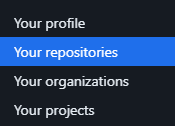
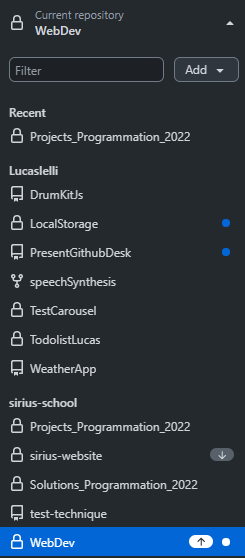
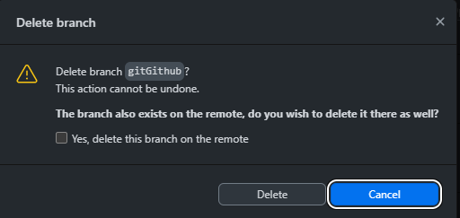

<!-- omit in toc -->
# Git & Github

<!-- omit in toc -->
## Table des matières
- [Rappel : introduction](#rappel--introduction)
- [Installation](#installation)
- [Rappel : repositery](#rappel--repositery)
- [Rappel : .gitignore](#rappel--gitignore)
- [Ajouter un projet, cloner un projet](#ajouter-un-projet-cloner-un-projet)
- [Naviguer avec Github Desktop](#naviguer-avec-github-desktop)
- [Les branches](#les-branches)
  - [Créer une nouvelle branche](#créer-une-nouvelle-branche)
  - [Fusionner des branches (merge)](#fusionner-des-branches-merge)
  - [Supprimer une branche](#supprimer-une-branche)
- [Discard changes](#discard-changes)
- [Commit](#commit)
- [Push](#push)
- [Fetch \& Pull](#fetch--pull)
- [Conclusion](#conclusion)

## Rappel : introduction

Git ne vient pas de nulle part, il répond à un besoin des développeurs. Il a été créer dans le but d'archiver en ligne tous les changements que le développeur et ses collaborateurs feront dans le code source du site ou du logiciel. Durant notre formation nous avons utilisés assez régulièrement **Git** et voici le temps pour l'utilisation de l'interface *Github Dekstop*. Le programme Github Desktop est beaucoup plus simple à utiliser que le programme de base, **Git** qui lui comme vous l'avez vu est dépourvu d'une interface visuelle.

## Installation

1. Logiquement en début de formation vous avez créer votre compte [Github](https://github.com/) ou lier votre adresse mail.
2. Télécharger et installer la version Windows de Github Desktop via ce [lien](https://desktop.github.com/). Pour les utilisateurs de Mac ou de Linux, le site devrait vous proposer la bonne version.
3. Une fois le programme installé, ouvrez-le et connectez-vous avec votre compte précédemment créer.

## Rappel : repositery

Qu'est qu'un repositery (dépôt) ? 
Contient tout l'**historique** des changements que vous avez effectués et permet à vos collègues de **contribuer** eux aussi au projet, pas mal non ⁉ 
Un exemple concret, votre site web fonctionne bien et vous décider de faire une mise à jour. A cause des modifications que vous venez de faire votre site est inutilisable, quoi que vous fassiez impossible de trouver la source du problème. Vous avez grâce à Git la possibilité de revenir en arrière en parcourant votre historique sur Github !

## Rappel : .gitignore

Il y a certains fichiers qu'il ne faut jamais publier sur Github, pour des raisons de sécurité et/ou de confidentialité. Le fichier ``.gitignore`` existe pour exclure de l'envoi les fichiers que vous ne devez pas publier. Je vous recommande fortement de prendre l'habitude de toujours créer ce fichier à **chaque nouveau projet**.

## Ajouter un projet, cloner un projet

Si tu as bien lié ton compte github.com à Github Desktop, lorsque tu cliques sur le menu déroulant en haut à gauche du programme : 
 
Tu auras la possibilité d'ajouter un repositery au programme Github Desktop : 
 
En cliquant sur le bouton *Add* ou *Ajouter* tu auras 3 possibilités : 

1. Clone repositery
   - Cette option te permet de cloner un projet déjà tracké sur ta machine donc en locale. C'est un projet existant sur Github.com.

2. Create new repositery
   - Cette option te permet de créer un repositery totalement vierge. Cette modal apparaitra : 
 
   - Si tu souhaites le publier directement sur Github.com et commencé le tracking, il faut cliquer sur **Publish repositery** : 
 

3. Add existing repositery
    - Cette option permet d'ajouter un dossier qui n'est pas encore tracké et donc pas disponible sur Github.com. Vous devez choisir le dossier de votre projet dans le modal suivant : 

4. Une autre façon d'ajouter un repositery : 
   - Un projet qui est déjà sur Github.com mais pas sur Github Desktop ni sur ta machine. Sur le site [https://github.com/](Github.com), clique sur ta photo de profil et accède à tes repositories : 

   - Lorsque tu es sur le repositery que tu souhaites cloner sur ta machine clique sur le bouton vert **code** :

   - Il ne reste plus qu'à cliquer sur ***"Open with Github Desktop"***

## Naviguer avec Github Desktop

Grâce à cette interface tu peux aussi :
- Cliquer pour accèder au menu déroulant : 
 
Cela affichera une liste de tes projets.
- Dans la liste si tu cliques droit sur l'un de tes projets plusieurs options s'offrent à toi : 

- Voici celles qui nous intéresse : 
  - **View on GitHub** : permet de voir le projet sur github.com.
  - **Show in Explorer** : permet d'ouvrir le dossier à l'emplacement du fichier de votre machine.
  - **Open in Visual Studio Code** : permet d'ouvrir le dossier du projet directement dans VSCode.
  - **Remove** : permet de supprimer le dossier du projet de Github Desktop, vous pouvez aussi cocher l'option pour le supprimer de votre machine.

## Les branches

### Créer une nouvelle branche

1. Ouvrez GitHub Desktop. Si vous avez déjà cloné un dépôt, il apparaîtra dans la liste des dépôts disponibles. Sinon, vous devrez cloner un dépôt en utilisant l'URL du dépôt distant.

2. Une fois que vous avez sélectionné le dépôt sur lequel vous souhaitez travailler, assurez-vous d'être sur l'onglet "Current repository" (dépôt actuel) dans GitHub Desktop.

3. En haut de la fenêtre de l'application, vous verrez un bouton avec le nom de la branche actuelle. Cliquez sur ce bouton pour afficher une liste déroulante des branches disponibles.

4. Dans la liste déroulante, cliquez sur l'option "New branch" (Nouvelle branche). Une fenêtre contextuelle s'ouvrira vous demandant de donner un nom à votre nouvelle branche.

5. Entrez un nom qui décrit la fonctionnalité que vous souhaitez créer pour votre nouvelle branche. Il est courant d'utiliser des noms qui décrivent la fonctionnalité ou le correctif que vous allez développer.

6. Vous pouvez également choisir de créer la nouvelle branche à partir de la branche actuelle ou d'une autre branche disponible. Par défaut, GitHub Desktop sélectionnera automatiquement la branche actuelle.

7. Une fois que vous avez donné un nom à votre nouvelle branche et sélectionné la branche de départ, cliquez sur le bouton "Create branch" (Créer une branche).

8. GitHub Desktop créera maintenant la nouvelle branche localement sur votre ordinateur. La nouvelle branche apparaîtra dans la liste déroulante des branches en haut de la fenêtre.

9.  Pour publier votre nouvelle branche sur GitHub, cliquez sur le bouton "Publish branch" (Publier la branche) à côté de la nouvelle branche dans la liste déroulante. Cela enverra la branche sur le dépôt distant correspondant sur GitHub.

Vous avez créé avec succès une nouvelle branche sur GitHub Desktop. Vous pouvez maintenant commencer à travailler sur cette branche en effectuant des modifications, en ajoutant des fichiers, etc. N'oubliez pas de faire des **commits réguliers** pour enregistrer vos modifications et de pousser vos commits sur GitHub en utilisant le bouton "Push origin" dans GitHub Desktop. Notez que si vous travaillez en équipe, il est important de communiquer avec vos collègues pour vous assurer que vous ne travaillez pas sur des branches qui pourraient entrer en conflit !

### Fusionner des branches (merge) 

1. Assurez-vous d'avoir terminé votre travail sur la branche que vous souhaitez fusionner avec la branche "main". Vous devez avoir effectué plusieurs commits et **poussé (push)** ces commits sur le dépôt distant.

2. Ouvrez GitHub Desktop et sélectionnez le dépôt dans lequel vous avez travaillé.

3. Assurez-vous d'être sur l'onglet "Current repository" (dépôt actuel) dans GitHub Desktop.

4. Dans la liste déroulante des branches, sélectionnez la branche que vous souhaitez fusionner avec la branche "main". La branche sélectionnée sera votre branche actuelle. Cliquez sur le bouton de la branche actuelle pour afficher la liste déroulante des branches.

5. Dans la liste déroulante, vous verrez l'option "Choose a branch to merge into" (Choisir une branche à fusionner avec). Sélectionnez "main" dans cette liste.

6. Après avoir sélectionné la branche "main", cliquez sur le bouton "Merge branch" (Fusionner la branche). Cela déclenchera le processus de fusion entre votre branche actuelle et la branche "main".

7. GitHub Desktop effectuera la fusion automatiquement en créant un nouveau commit de fusion. Si des conflits surviennent pendant la fusion, GitHub Desktop vous le signalera et vous devrez les résoudre manuellement. Suivez les instructions fournies par GitHub Desktop pour résoudre les conflits.

8.  Une fois que la fusion est terminée avec succès, vous pouvez pousser le commit de fusion sur le dépôt distant en cliquant sur le bouton "Push origin" (Pousser l'origine) dans GitHub Desktop.

Assurez-vous que la fusion a été correctement effectuée dans votre dépôt (repositery) sur GitHub.com.

### Supprimer une branche

⚠️ ATTENTION ⚠️ Une suppression est définitive, vérifiez que tout votre travail a bien été fusionné avec votre branche principale avant toute manipulation dans le menu de suppression.

1. Ouvrez GitHub Desktop et sélectionnez le dépôt contenant la branche que vous souhaitez supprimer.

2. Assurez-vous d'être sur l'onglet "Current repository" (dépôt actuel) dans GitHub Desktop.

3. Dans la liste déroulante des branches, cliquez droit sur la branche que vous souhaitez supprimer.

4. Une liste d'options apparait dont l'option 'delete' cliquez sur cette option.

5. Une fenêtre contextuelle apparaîtra pour confirmer la suppression de la branche. Vérifiez une fois de plus que vous souhaitez bien supprimer la branche, car **cette action est irréversible**.

1. Cochez 'Yes, delete this branch on the remote' (Oui, supprimer cette branche sur le dépôt distant) si vous souhaitez supprimer la branche aussi bien en local, sur votre machine et sur Github.com.

Notez que si d'autres collaborateurs travaillent sur la même branche ou si vous avez déjà fusionné des commits sur d'autres branches, il est recommandé de ne pas supprimer la branche immédiatement, car cela peut entraîner la perte des commits et de l'historique de la branche. Dans ce cas, il est préférable de conserver la branche ou de la supprimer ultérieurement une fois qu'elle n'est plus nécessaire.

## Discard changes

Avec *Github Desktop* vous avez la possibilité de supprimer les changements effectués aussi bien sur le programme que dans votre machine. En cliquant droit sur l'un des éléments modifiés dans la liste de gauche.

## Commit

En bas à gauche du programme, vous avez un champ qui vous permet d'ajouter un message à votre commit. Il est super important de noter les changements que vous avez effectués dans votre code. Un bon message vous permettra de vous y retrouver plus facilement si vous devez revenir en arrière. Même si il est possible d'ajouter une description c'est purement facultatif.

Il ne reste plus qu'à cliquer sur le bouton "Commit to *branch*" et le tour est jouer, votre commit est enregistré.

## Push

Deux façons de Push s'offrent à vous. Lorque vous effectuez un commit, Github Desktop est assez malin pour vous proposer de Push directement :

La deuxième façon est de le faire sur le bouton juste à coté du système de branche :

## Fetch & Pull

Le "fetch" se fait quasiment automatiquement lorsque vous sélectionner un repository sur Github Desktop, il va donc comparé la version en ligne et la version sur votre machine. Si la version en ligne est plus récente, le programme vous proposera de "Pull".

## Conclusion

Git et Github sont des outils indispensables pour un développeur et pour travailler en équipe. Il y a beaucoup d'avantage quand on l'utilise bien et nous aurons tout le reste de la formation pour se familiariser avec ce formidable outil. 
**Fini les clés USB, Github est là !**

[:arrow_up: Revenir au top](#table-des-matières)

[:rewind: Retour au sommaire du cours](../../README.md)

> Created by [Lucas Ielli](https://github.com/LucasIelli)
