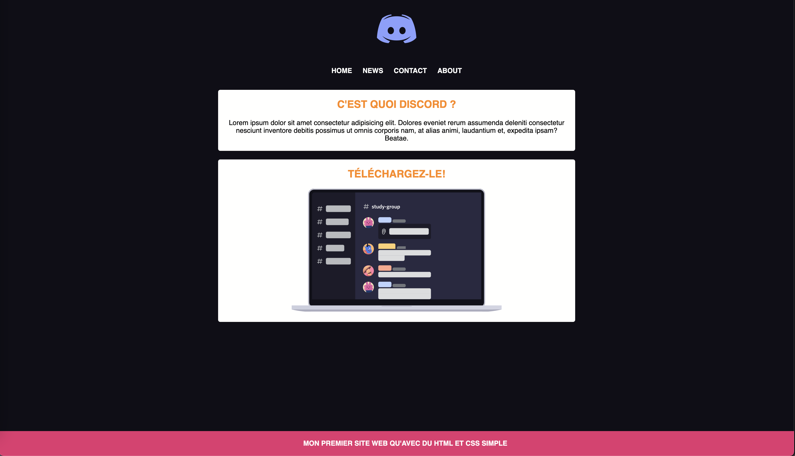

# Maquette Discord

Il est temps de mettre en pratique tout ce qu'on a vu jusqu'à maintenant. Tu vas devoir réaliser la page ci-dessous sans que je te donnes toutes les étapes.

## :memo: Objectifs

- Réaliser tes premières pages de style CSS
- Suivre des consignes précises
- Appliquer un style CSS en respectant une maquette donné
- Apprendre à se débrouiller en allant lire la théorie vue ou la documentation

## :white_check_mark: Evaluations

- Respect des consignes
- La syntaxe est correcte
- L'indentation est correcte

## Mise en place

1. Crée un nouveau repository public nommé "Maquette Discord" sur ton compte Github flambant neuf et fais en sorte que ton travail y soit push!
2. Copie et colle le code HTML fournit plus bas dans un nouveau fichier HTML. (Si t'es vraiment chaud, tu peux essayer de faire le code HTML toi même)
3. Crée une nouvelle feuille de style et lie-là à ton fichier HTML.
4. Affiche la page dans ton navigateur (avec Live Server) pour voir le résultat. Tous les éléments sont là mais rien n'est mis en place.
5. Regarde le screenshot plus bas et tente de reproduire le même style.
6. Je te fournis plus bas le code HTML, les couleurs utilisées, quelques indications de taille et le code CSS avec seulement les sélecteurs.
7. Il n'y a pas qu'une bonne méthode, si tu veux utiliser tes propres sélecteurs, tu peux!
8. Tu as vus toute la théorie nécessaire à la réalisation de cet exercice.
9. Souviens-toi, utilise l'inspecteur d'élément pour tester des valeurs directement dans ton navigateur.
10. N'hésite pas à retourner voir la théorie et la documentation en cas de besoin.
11. Essaye d'allez le plus loin possible sans demander de l'aide.
12. Quand tu as finis, envoie moi le lien vers ton repository
13. Bon courage!

## Screenshot

Le premier screenshot représente la page "zoomée", mais au final tu dois arriver au résultat du screenshot 2.




## HTML

```html
<!DOCTYPE html>
<html lang="fr">
<head>
  <meta charset="UTF-8">
  <meta http-equiv="X-UA-Compatible" content="IE=edge">
  <meta name="viewport" content="width=device-width, initial-scale=1.0">
  <title>Discord</title>
  <!-- insère ici ta feuille de style -->
</head>
<body>
  <header>
    <div class="container">
      
      <nav>
        <ul>
          <li><a href="#">Home</a></li>
          <li><a href="#">News</a></li>
          <li><a href="#">Contact</a></li>
          <li><a href="#">About</a></li>
        </ul>
      </nav>
    </div>
  </header>
  <section>
    <h2>C'est quoi Discord ?</h2>
    <p>Lorem ipsum dolor sit amet consectetur adipisicing elit. Dolores eveniet rerum assumenda deleniti consectetur nesciunt inventore debitis possimus ut omnis corporis nam, at alias animi, laudantium et, expedita ipsam? Beatae.</p>
  </section>
  <section>
    <h2>Téléchargez-le!</h2>
    
  </section>
  <footer>
    <div>Mon premier site web qu'avec du HTML et CSS simple</div>
  </footer>
</body>
</html>
```

## Ressources

Tu peux aussi télécharger les images ici: [📁 Assets](https://github.com/sirius-school/assets/tree/main/html-css/discord)

## Couleurs

- Fond de la page: #0f0e17
- Texte blanc: #fffffe
- Fond des sections: #fffffe
- Titre: #ff8906
- Fond du bas de page: #e53170

## Font

- La police d'écriture pour toute la maquette est **Verdana**
- Les titres sont en majuscules

## Tailles

- le logo fait 100px de large.
- la largeur des sections est de 790px **max**. ❗ Attention à la taille réelle (inspecte ton élément!!)... Indice: `content-box`
- pour ce qui est des margin et padding, utilise les valeurs que tu veux tant que ça ressemble un minimum à ce qu'il y a sur les screenshots.

## Positions

- Il faut centrer **tout** le texte sur la page.
- Il faut centrer les sections grâce aux **margins**.
- Le footer doit être positionné de manière **fixe** en bas de page.

## CSS

N'oublie pas, ceci sont les sélecteurs que j'ai utilisé mais tu peux sans problème tenter de réaliser l'exercice sans en prendre compte et choisir tes propres sélecteurs si tu te sens à l'aise. Il n'y a pas de bonne ou mauvaise utilisation des sélecteurs, juste une façon optimale de le faire.

```css
body{
  /* insère ton style ici */
}
header .container{
  /* insère ton style ici */
}

header .container img{
  /* insère ton style ici */
}

nav{
  /* insère ton style ici */
}

nav ul {
  /* insère ton style ici */
}

nav li {
  /* insère ton style ici */
}

nav li a {
  /* insère ton style ici */
}

section{
  /* insère ton style ici */
}

h2{
  /* insère ton style ici */
}

p{
  /* insère ton style ici */
}

footer{
  /* insère ton style ici */
}
```

[:rewind: Retour au sommaire du cours](./README.md#table-des-matières)
