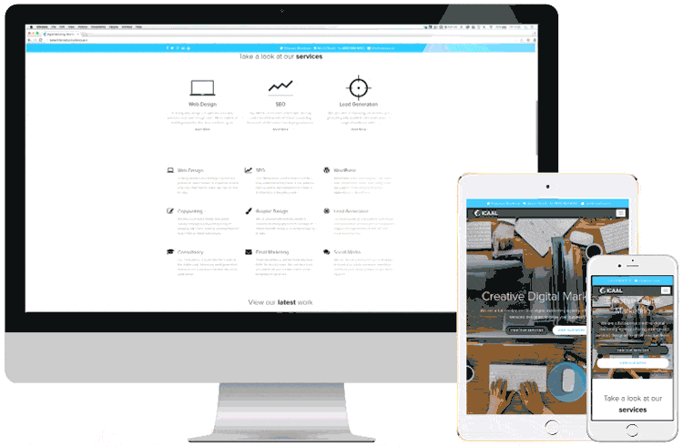
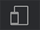
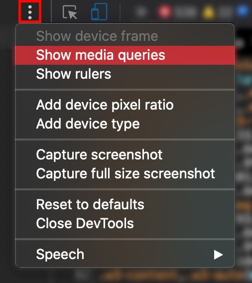
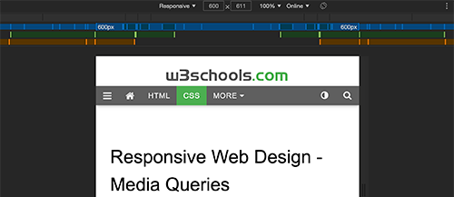

<!-- omit in toc -->
# Responsive Design

Voyons ensemble comment rendre nos pages accessibles sur toutes les tailles d'écran.

<!-- omit in toc -->
## Table des matières

- [Qu'est-ce que c'est que le responsive design](#quest-ce-que-cest-que-le-responsive-design)
- [Viewport](#viewport)
  - [Comment configurer le viewport](#comment-configurer-le-viewport)
  - [Taille du contenu dans le viewport](#taille-du-contenu-dans-le-viewport)
- [Images responsive](#images-responsive)
- [Vue en grille](#vue-en-grille)
- [Media Queries](#media-queries)
  - [Ajouter un breakpoint](#ajouter-un-breakpoint)
  - [Toujours penser son site en Mobile First](#toujours-penser-son-site-en-mobile-first)
  - [Des breakpoints typiques](#des-breakpoints-typiques)
  - [Orientation: Portrait / Landscape](#orientation-portrait--landscape)
  - [Cacher des éléments](#cacher-des-éléments)
  - [Changer le taille d'une police](#changer-le-taille-dune-police)
  - [Tester ses media queries](#tester-ses-media-queries)
- [En savoir plus](#en-savoir-plus)

## Qu'est-ce que c'est que le responsive design



Le Responsive Design, c'est l'art de perfectionner l'ergonomie de votre interface pour garantir une expérience optimale sur une variété d'appareils, qu'il s'agisse de smartphones, de tablettes, d'ordinateurs, et bien plus encore.

L'approche du Responsive Design repose principalement sur l'utilisation de langages fondamentaux tels que HTML et CSS, sans recourir à des scripts complexes ou à des logiciels dédiés. Cependant, il est possible d'exploiter des bibliothèques spécifiques telles que Tailwind, Bootstrap, Foundation, ou Skeleton, pour faciliter le processus de mise en page et d'adaptation.

L'objectif majeur du Responsive Design est de maintenir l'intégrité du contenu sur tous les dispositifs, en évitant de le supprimer arbitrairement pour s'adapter à des résolutions d'écran plus petites. Plutôt que de supprimer du contenu, on privilégie la possibilité de masquer certains éléments non essentiels, tels que des illustrations, afin de libérer de l'espace pour les informations essentielles.

Pour accomplir cela, le Responsive Design tire parti du pouvoir du CSS, permettant de redimensionner, déplacer, masquer, agrandir ou réduire les éléments de manière harmonieuse et fluide.

[:arrow_up: Revenir au top](#table-des-matières)

## Viewport

Le viewport, dans le contexte du Responsive Design, représente la portion visible d'une page web lorsqu'elle est affichée à l'utilisateur. Sa dimension varie en fonction de l'appareil utilisé, étant généralement plus restreinte sur un smartphone que sur un écran d'ordinateur.

Auparavant, avant l'avènement des tablettes et des smartphones, les concepteurs de sites web se limitaient souvent à créer des pages web avec une taille fixe, principalement adaptée aux écrans d'ordinateur. Lorsque les tablettes et les téléphones mobiles ont fait leur entrée, la solution initiale consistait à réduire simplement la taille de la page pour qu'elle s'affiche sur ces nouveaux appareils. Bien que cette méthode fonctionnait dans une certaine mesure, elle ne garantissait pas toujours une lisibilité optimale.

Le Responsive Design, quant à lui, vise à résoudre ce problème en adoptant une approche plus sophistiquée pour adapter la mise en page et les éléments de la page en fonction de la taille du viewport. Cette approche permet une expérience utilisateur plus fluide et agréable, en optimisant la lisibilité et la convivialité sur une gamme variée d'appareils, des ordinateurs de bureau aux smartphones.

[:arrow_up: Revenir au top](#table-des-matières)

### Comment configurer le viewport

```html
<meta name="viewport" content="width=device-width, initial-scale=1.0">
```

Cette balise est utilisée dans le code HTML pour contrôler la manière dont la page web est affichée sur les différents appareils, en particulier lorsqu'il s'agit de créer une expérience de navigation adaptative (Responsive Design) pour les dispositifs mobiles. Voici ce que chaque partie de cette balise signifie :

- `name="viewport"` : Cette partie de la balise indique au navigateur que nous définissons des paramètres de vue (viewport) pour la page web. En d'autres termes, elle spécifie que nous voulons contrôler la manière dont la page est affichée à l'utilisateur en fonction de la taille de l'écran de l'appareil.

- `content="width=device-width, initial-scale=1.0"` : Cette partie de la balise définit les paramètres de vue (viewport) proprement dits. Voici ce que font ces paramètres :

  - `width=device-width` : Cette instruction indique au navigateur de régler la largeur de la page web pour qu'elle corresponde à la largeur réelle de l'écran de l'appareil. Cela signifie que la page s'ajuste automatiquement à la largeur de l'écran de l'appareil, quelle que soit sa taille, ce qui est essentiel pour garantir une mise en page adaptée aux dispositifs mobiles et de bureau.

  - `initial-scale=1.0` : Ce paramètre spécifie le niveau de zoom initial auquel la page web est affichée lorsqu'elle est chargée dans le navigateur. En définissant initial-scale sur 1.0, cela signifie que la page est affichée sans zoom initial, ce qui permet au contenu d'apparaître à sa taille d'origine. Cette option est cruciale pour assurer que le contenu est clair et lisible dès le chargement de la page, quel que soit l'appareil utilisé.

En combinant ces deux paramètres, la balise <meta> crée une base solide pour le Responsive Design en garantissant que la page web s'adapte correctement à la taille de l'écran de l'appareil et en offrant une expérience utilisateur cohérente sans zoom excessif lors du chargement initial de la page. Cela permet aux utilisateurs de naviguer facilement sur votre site web, qu'ils utilisent un smartphone, une tablette ou un ordinateur de bureau.

[Exemple de scale](https://www.w3schools.com/css/css_rwd_viewport.asp)

[:arrow_up: Revenir au top](#table-des-matières)

### Taille du contenu dans le viewport

Il faut éviter de placer des éléments qui sortiraient du viewport et qui pourraient créer du scrolling horizontale. Les utilisateurs ont l'habitudes de scroller de manière verticale, produire l'inverse pourrait amener à une mauvaise expérience utilisateur.

Il ne faut pas non plus placer des éléments qui se basent sur une largeur de viewport spécifique pour être affiché correctement. Préféré du contenu flexible qui peut s'afficher correctement dans toutes les tailles de viewport.

On va utiliser les media queries pour appliquer des styles différents à nos éléments en fonction des viewport que l'ont veut configurer.

[:arrow_up: Revenir au top](#table-des-matières)

## Images responsive

Une image responsive est une image qui se redimensionne correctement sur n'importe quelle résolution. Il y a plusieurs possibilités pour faire cela.

- Utiliser la propriété `width` en css et la valeur 100%. Ainsi l'image s'adaptera à son conteneur.
- Utiliser la propriété `max-width` en css et une valeur à ne pas dépasser. Ainsi l'image sera responsive jusqu'à la taille précisée.
- Montrer des images différentes en fonction de la largeur du viewport avec la balise HTML `<picture>`

```html
<picture>
  <source srcset="img_smallflower.jpg" media="(max-width: 600px)">
  <source srcset="img_flowers.jpg" media="(max-width: 1500px)">
  <source srcset="flowers.jpg">
  
</picture>
```

`<picture></picture>` est particulièrement utile dans le contexte du Responsive Design et de la gestion des images pour les raisons suivantes :

1. **Images adaptatives** : La balise <picture> permet de fournir des images adaptatives, ce qui signifie que différentes versions de l'image peuvent être proposées en fonction de la taille de l'écran de l'utilisateur. Cela garantit que les images sont optimisées pour chaque appareil, ce qui est essentiel pour garantir une expérience utilisateur de qualité.
2. **Optimisation de la performance **: En fournissant des images adaptées à la taille de l'écran, la balise <picture> permet de réduire la taille des fichiers image téléchargés, ce qui améliore la performance du site en termes de vitesse de chargement. Cela est particulièrement important pour les utilisateurs sur des connexions Internet plus lentes ou des appareils mobiles.
3. **Qualité d'image optimisée** : La balise <picture> permet également de sélectionner la meilleure qualité d'image en fonction de la taille de l'écran. Ainsi, les utilisateurs sur des écrans plus grands bénéficient d'images de haute qualité, tandis que ceux sur des écrans plus petits voient des images de qualité adaptée.
4. **Accessibilité** : L'utilisation de <picture> permet de mettre en place des descriptions alternatives (attribut alt) pour chaque version de l'image, améliorant ainsi l'accessibilité pour les utilisateurs ayant des besoins spécifiques.
5. **Compatibilité** : La balise <picture> est bien prise en charge par les navigateurs modernes, ce qui signifie qu'elle peut être utilisée en toute confiance dans la création de sites web.

Cependant, il est important de noter que son utilisation peut varier en fonction des besoins du projet. Dans certains cas, les développeurs peuvent préférer d'autres méthodes d'optimisation d'images, telles que l'utilisation de formats d'image modernes comme WebP ou l'utilisation de techniques de chargement paresseux pour améliorer encore la performance. Le choix dépendra des spécificités du projet et des objectifs de conception du site web.

[En savoir plus](https://www.w3schools.com/tags/tag_picture.asp)

[:arrow_up: Revenir au top](#table-des-matières)

## Vue en grille

Penser son site en grille c'est une pratique pour faire du responsive design.

La plupart du temps, un site web est découpé en 12 colonnes. Chacune ayant un taille identique ou spécifique en fonction des besoins. Votre vue en grille représente 100% de la largeur du viewport.

Voici un exemple de grille de 12 colonnes en CSS. 

```css
[class*="col-"] {
  float: left;
}

.col-1 {width: 8.33%;}
.col-2 {width: 16.66%;}
.col-3 {width: 25%;}
.col-4 {width: 33.33%;}
.col-5 {width: 41.66%;}
.col-6 {width: 50%;}
.col-7 {width: 58.33%;}
.col-8 {width: 66.66%;}
.col-9 {width: 75%;}
.col-10 {width: 83.33%;}
.col-11 {width: 91.66%;}
.col-12 {width: 100%;}
```

On utilise ces classes pour définir le nombres de colonnes que notre élément doit prendre. Cette technique est notamment utilisé dans Bootstrap. Seulement telle qu'elle c'est responsive, jusqu'à un certain stade, dès que l'on passe sur une résolution fort basse, le tout est écrasé. De nouveau, on va voir les Media Queries un peu plus bas pour remédier à cela.

Ensuite en HTML il faut que l'ensemble des colonnes utilisés dans une rangée s'additionne pour faire 12. C'est mieux.

```html
<div class="row">
  <div class="col-3">...</div> <!-- 25% -->
  <div class="col-9">...</div> <!-- 75% -->
</div>
```

[Voir un exemple](https://www.w3schools.com/css/tryit.asp?filename=tryresponsive_styles)

[:arrow_up: Revenir au top](#table-des-matières)

## Media Queries

Media Query est une technique en CSS3, on utilise `@media` pour inclure des propriétés CSS qui devront être appliquées que si une certaine condition est vraie.

```css
/* Si la largeur de la fenêtre du navigateur est de 600px ou moins, le fond de body deviendra rouge*/
@media only screen and (max-width: 600px) {
  body {
    background-color: red;
  }
}
```

:book: [La documentation des MQ](https://www.w3schools.com/cssref/css3_pr_mediaquery.asp)

[:arrow_up: Revenir au top](#table-des-matières)

### Ajouter un breakpoint

Un breakpoint est donc une règle (généralement une largeur) qui doit être vraie pour appliquer les propriétés qui lui sont associées.

Dans l'exemple vu plus haut, on avait nos classes de nos 12 colonnes, mais si vous avez [regardé l'exemple](https://www.w3schools.com/css/tryit.asp?filename=tryresponsive_styles) et essayez de réduire votre fenêtre de navigateur, le site devient peu lisible une fois que le viewport est trop petit. 

On va ajouter le code suivant pour régler notre soucis:

```css
@media only screen and (max-width: 768px) {
  /* For mobile phones: */
  [class*="col-"] {
    width: 100%;
  }
}
```

Voici [le résultat](https://www.w3schools.com/css/tryit.asp?filename=tryresponsive_breakpoints)

[:arrow_up: Revenir au top](#table-des-matières)

### Toujours penser son site en Mobile First

Il est conseillé de toujours penser son site d'abord pour l'affichage sur smartphone plutôt que sur desktop. Cela permet de s'assurer d'une page plus rapide pour l'affichage sur ces petits appareils. 

Donc au lieu d'appliquer le breakpoint pour l'affichage mobile, on va le faire pour l'affichage desktop.

```css
/* For mobile phones: */
[class*="col-"] {
  width: 100%;
}

@media only screen and (min-width: 768px) {
  /* For desktop: */
  .col-1 {width: 8.33%;}
  ...
  .col-12 {width: 100%;}
}
```

[:arrow_up: Revenir au top](#table-des-matières)

### Des breakpoints typiques

Il est tout a fait possible d'ajouter autant de breakpoint que vous voulez. Voici quelques uns des plus utilisés.

```css
/* Extra small devices (phones, 600px and down) */
@media only screen and (max-width: 600px) {...}

/* Small devices (portrait tablets and large phones, 600px and up) */
@media only screen and (min-width: 600px) {...}

/* Medium devices (landscape tablets, 768px and up) */
@media only screen and (min-width: 768px) {...}

/* Large devices (laptops/desktops, 992px and up) */
@media only screen and (min-width: 992px) {...}

/* Extra large devices (large laptops and desktops, 1200px and up) */
@media only screen and (min-width: 1200px) {...}
```

[:arrow_up: Revenir au top](#table-des-matières)

### Orientation: Portrait / Landscape

Vous pouvez utiliser les media queries pour changer le style de votre page en fonction de l'orientation du navigateur.

```css
@media only screen and (orientation: landscape) {
  body {
    background-color: red;
  }
}
```

[:arrow_up: Revenir au top](#table-des-matières)

### Cacher des éléments

Il est également possible de cacher certains éléments via les media queries. Attention à ne pas masquer des infos importantes mais plutôt des éléments de style non-essentiel à votre page.

```css
/* If the screen size is 600px wide or less, hide the element */
@media only screen and (max-width: 600px) {
  div.example {
    display: none;
  }
}
```

[:arrow_up: Revenir au top](#table-des-matières)

### Changer le taille d'une police

```css
/* If the screen size is 601px or more, set the font-size of <div> to 80px */
@media only screen and (min-width: 601px) {
  div.example {
    font-size: 2em;
  }
}

/* If the screen size is 600px or less, set the font-size of <div> to 30px */
@media only screen and (max-width: 600px) {
  div.example {
    font-size: 1.5em;
  }
}
```

[:arrow_up: Revenir au top](#table-des-matières)

### Tester ses media queries

C'est bien beau de créer tout un ensemble de règles pour les différents appareils. Mais on ne fait pas ça de tête et sans tester. Pour vous aidez il n'y a pas besoin de lancer votre site sur votre smartphone ou tablette, mais à tout simplement utiliser les outils de développement de chrome/firefox.

Appuyez sur `F12` et cliquez ensuite sur l'icône suivante: 

Une fois l'interface ouverte vous pouvez sélectionner différentes résolution pré-définie, en rajouter vous même ou tout simplement utiliser le mode `responsive` pour tester la réactivité de votre site.

 **Avantage de chrome:** il est possible de "voir" vos media queries en cliquant sur les 3 petits points en haut à droite. Cela permet d'avoir une visualisation des différentes tailles configurées et de redimensionner votre site immédiatement en cliquant sur une de ces tailles.




[:arrow_up: Revenir au top](#table-des-matières)

## En savoir plus

- [Les bonnes pratiques en Responsive Design](02-rd-bonnes-pratique.md)
- [Toutes les propriétés de `@media`](https://www.w3schools.com/cssref/css3_pr_mediaquery.asp)
- [Le mode responsive de Firefox](https://developer.mozilla.org/fr/docs/Outils/Vue_adaptative)
- [Le mode responsive de Chrome](https://developers.google.com/web/tools/chrome-devtools/device-mode)

[:arrow_up: Revenir au top](#table-des-matières)

[:rewind: Retour au sommaire du cours](./README.md#table-des-matières)

