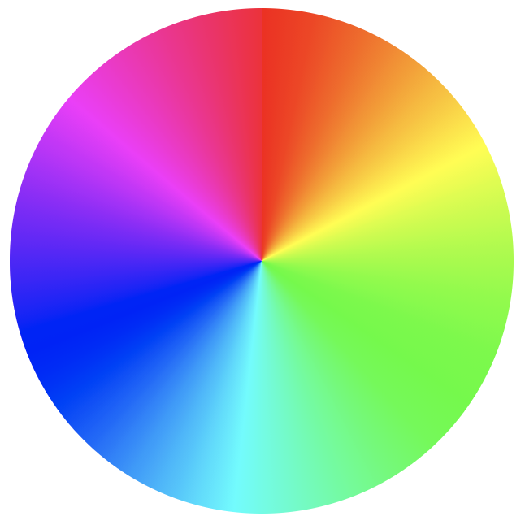
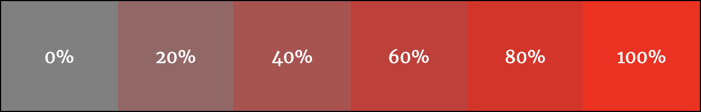
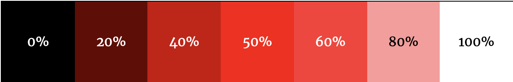

<!-- omit in toc -->
# Plus de CSS, toujours plus

Voyons ensemble pleins de nouvelles choses en CSS, un peu en vrac. A vous de choisir ce que vous trouver utile ou pas à appliquer dans vos projets.

<!-- omit in toc -->
## Table des matières

- [Techniques](#techniques)
  - [Variables ou custom properties](#variables-ou-custom-properties)
  - [RGB, Hexadecimal ou HSL?](#rgb-hexadecimal-ou-hsl)
  - [Nesting](#nesting)
  - [Placeholder](#placeholder)
  - [Spécificité CSS](#spécificité-css)
  - [!important](#important)
- [Propriétés](#propriétés)
  - [Aspect-ratio](#aspect-ratio)
  - [Formes](#formes)
  - [Inherit](#inherit)

## Techniques

Voici quelques nouvelles technique disponible en CSS. Ce ne sont pas des propriétés mais plus d'autres façons d'utiliser CSS pour faire ce qu'on veut.

### Variables ou custom properties

Depuis CSS3 il est possible de créer des variables. Il s'agit d'informations que pouvez réutilisez dans toutes votre feuille de style. Vous pouvez stocker des couleurs, des polices ou n'importe quelle autre propriété CSS.

Un des avantages des variables est la lisibilité. En effet il sera plus facile de lire `primary-color`que le code hexadécimal de cette couleur `#FF4000`.

Un autre avantage, évident, c'est la facilité d'éffectuer des modifications sur l'ensemble de sa feuille de style. Il ne faut en effet modifier qu'une fois la valeur de sa variable et le changement se ferra partout où vous avez indiqué cette variable.

<!-- omit in toc -->
#### Utilisation simple

On déclare une variable dans `::root` en indiquant deux tirets devant son nom. Ensuite il faut utiliser la valeur `var(nom-de-variable)`.

```css
:root {
  --main-bg-color: red;
}
element {
  background-color: var(--main-bg-color);
}
```

[:book:En savoir plus](https://developer.mozilla.org/fr/docs/Web/CSS/Using_CSS_custom_properties)

[:arrow_up: Revenir au top](#table-des-matières)

<!-- omit in toc -->
### Import

Vous commencez sans doute à avoir une feuille de style à rallonge et vous ne vous y retrouvez plus? Et bien la solution réside dans les `import`. En effet la règle `@import`permet d'inclure une feuille de style dans une autre. Ainsi vous pouvez diviser votre travail en plusieurs feuilles en fonction des différentes sections que vous devez styliser.

Il est également possible d'utiliser les mediaqueries pour utiliser une feuille de style particulière si la règle est respectée.

**Exemple**: main.css, header.css, footer.css, nav.css, card.css, print.css...

<!-- omit in toc -->
#### Utilisation

Il suffit de placer **au dessus de toute autre règle/sélecteur** votre `@import`, lui indiquer la feuille qu'il doit importer et préciser éventuellement les règles qu'il doit respecter pour utiliser cette feuille de style.

```css
@import "header.css";
@import url("nav.css");
@import "printstyle.css" print; /* use it only on print */
@import "mobile.css" screen and {max-width: 768px}; /* use it only if media is screen and viewport is max 768px */
```

Tout le code contenu dans votre feuille importé sera ajouté. 

<!-- omit in toc -->
#### Une feuille de style ou plusieurs?

Il est donc intéressant de créer une feuille de style principale `style.css` et de la lier à toutes vos pages. Ensuite dedans vous importer toutes vos pages de "composant". Ainsi vous ne devez pas vous occuper d'une page à rallonge pleines de lignes de CSS, mais vous divisez votre travail dans plusieurs pages.

```css
/* style.css */

@import "header.css";
@import "nav.css";
@import "content.css";

/* Des propriétés liées à toutes vos pages (comme les polices d'écriture, les couleurs,...) */

```

[:arrow_up: Revenir au top](#table-des-matières)

### RGB, Hexadecimal ou HSL?

Jusqu'à maintenant on a principalement utilisé des codes hexadécimaux pour définir nos couleurs dans nos feuilles de styles. Mais cela n'est pas très pratique... Voyons une solution: l'utilisation des couleurs HSL.

<!-- omit in toc -->
#### La problématique

Le soucis avec les couleurs définie en **RGB** ou **hexadecimal** c'est qu'on a pas une idée claire de ce que représente le code en couleur. Alors oui on peut s'aider du **color picker** de VSCode, mais nous pourrions aussi déterminer nos couleurs différemment.

```css
.rgb{color: rgb(255,0,0)}
.hex{color: #FF0000}
```

<!-- omit in toc -->
#### La solution

Utiliser les couleurs en **HSL**.

- H pour "hue" ou teinte
- S pour "saturation"
- L pour "lightness" ou luminosité

```css
.hsl{color: hsl(0, 100%, 50%);}
```

La première valeur prend un chiffre de 0 à 360 et les deux autres prennent un %. Voyons comment retrouver nos couleurs.

<!-- omit in toc -->
##### Hue

La teinte est en faite la couleur que vous souhaitez. Prenez la roue de couleur ci-dessous. On démarre à 0 en haut et donc dans les tons de rouge. Ensuite on tourne dans le sens des aiguilles d'une montre. Par exemple si on prend la valeur 90 on se retrouve dans les verts. À 180 on est dans du cyan, à 270 on est dans les bleus-mauve et si on revient à 360 on retourne en rouge. Une fois que l'on a compris cela, c'est déjà plus simple.



<!-- omit in toc -->
##### Saturation

La saturation c'est à quel point la couleur est grise. Si la valeur approche de 0% on est dans les gris et si on approche des 100% on a la couleur pure.



<!-- omit in toc -->
##### Lightness

La luminosité détermine si la couleur est plus proche du noir (0%) ou du blanc (100%)



<!-- omit in toc -->
#### Conclusion

Il est donc très facile d'apporter des modifications à une couleur, il suffit de trouver la bonne teinte, ensuite si elle ne convient pas totalement on peut facilement changer sa saturation ou luminosité. 

C'est aussi plus simple à gérer en cas de changement de couleur. Exemple:

```css
.button{background-color: hsl(0, 100%, 50%)}
.button:hover{background-color: hsl(0, 100%, 30%)}

.button-hex{background-color: #ff0000}
.button-hex:hover{background-color: #990000}

.button-rgb{background-color: rgb(255, 0, 0)}
.button-rgb:hover{background-color: rgb(153, 0, 0)}
```

> Dans cet exemple, on change que la luminosité, mais lorsqu'on li la couleur en HSL ça à du sens, tandis que l'exemple en hexadecimal ou rgb est plus confus.

Et pour allez encore plus loins on pourrait utiliser les variables CSS.

```css
:root{--primary: 0}
.button{background-color: hsl(var(--primary), 100%, 50%)}
.button:hover{background-color: hsl(var(--primary), 100%, 30%)}
```

> Dans cet exemple, on utilise une variable, du coup si on décide de changer notre couleur principale, il suffit de changer la variable et on garde le même effet de hover sur notre bouton.

> :bulb: Voici [un site web](https://itpastorn.github.io/webbteknik/future-stuff/svg/color-wheel.html) pour retrouver une couleur sur la roue chromatique

[:arrow_up: Revenir au top](#table-des-matières)

### Nesting

Le CSS s'est mis à jour! Il fût un temps où il fallait passer par un pré-processeur (SASS) pour avoir droit à des fonctionnalités supplémentaires dans le CSS. Mais au fur et à mesure où les développeurs adoptaient ces techniques, l'équipe en charge de maintenir le code du CSS décidaient d'ajouter ces fonctionnalités nativement. C'est le cas du **Nesting**.

Mais qu'est-ce que ça veut dire? Et bien on peut organiser son code de façon un peu plus logique et lisible pour nous petits humains. On va pouvoir placer à l'intérieur de nos sélecteurs d'autres sélecteurs et du coup directement jouer sur la descendance par exemple. Cela nous évitera des erreurs de sélecteurs et simplifie notre sélection de nos éléments. Alors il ne faut pas spécialement faire du nesting sur tous les projets. Mais quand ceux-ci se compliquent c'est toujours bien d'essayer de se simplifier la vie.

<!-- omit in toc -->
#### Sélection d'enfant

On peut inclure un sélecteur à l'intérieur d'un autre avec ou sans le symbole "**&**". Cela aura pour effet de sélectionner un enfant à l'intérieur d'un parent. Pensez bien à indenter l'enfant à l'intérieur du parent.

```css
/* Sans le sélecteur de nesting */
parent {
  /*  styles du parent */
  child {
    /* styles de l'enfant du parent*/
  }
}

/* Avec le sélecteur de nesting */
parent {
  /*  styles du parent */
  & child {
    /* styles de l'enfant du parent*/
  }
}

/* L'interprétation du navigateur dans les deux cas */
parent {
  /*  styles du parent */
}
parent child {
  /* styles de l'enfant du parent*/
}
```

> :exclamation: Attention, comme il s'agit d'une nouveauté, certains navigateurs ont toujours besoin du symbole "&". A l'heure de l'écriture de ces lignes, Chrome en a encore besoin. Donc tester avec avant de penser que vous vous êtes trompés.

<!-- omit in toc -->
#### Combinateur

Il est possible d'utiliser un autre symbole, le "**+**" pour sélectionner le premier élément du parent.

```html
<h2>Heading</h2>
<p>This is the first paragraph.</p>
<p>This is the second paragraph.</p>
```

```css
h2 {
  color: tomato;
  & + p {
    color: white;
    background-color: black;
  }
}
```

<!-- omit in toc -->
#### Utiliser plusieurs sélecteurs

Il est possible d'utiliser le nesting avec plusieurs sélecteurs. Normalement quand on veut sélectionner un éléments qui a plusieurs classes, il suffit de les accrocher. En nesting il va falloir accrocher le symbole "**&**" plutôt que de laisser un espace comme dans les exemples vu plus haut.

```css
.a {
  /* styles pour un element avec la class="a" */
  .b {
    /* styles pour un element avec la class="b" qui est un descendant de la class="a" */
  }
  &.b {
    /* styles pour un element avec la class="a b" */
  }
}

/* L'interprétation du navigateur */
.a {
  /* styles pour un element avec la class="a" */
}
.a .b {
  /* styles pour un element avec la class="b" qui est un descendant de la class="a" */
}
.a.b {
  /* styles pour un element avec la class="a b" */
}
```

<!-- omit in toc -->
#### Pas de concatenation 😭

Pour ceux qui aurait des notions en SASS, il y avait une technique fort utile pour concaténer ses sélecteurs grâce au nesting. Ce n'est pas (encore?) possible en CSS3. 

```css
.component {
  &__child-element {
  }
}
/* Dans SASS ça donne ça */
.component__child-element {
}
```

<!-- omit in toc -->
#### En savoir plus

Le nesting en CSS est récent, il y a donc sûrement pas mal de nouveautés qui arriveront. Ici je vous ai parlé du minimum pour commencer à utiliser cette technique. Si vous voulez en savoir plus, comme d'habitude, je vous invite à consulter [:book: la documentation](https://developer.mozilla.org/en-US/docs/Web/CSS/CSS_nesting/Using_CSS_nesting)

[:arrow_up: Revenir au top](#table-des-matières)

### Placeholder

Je vais vous présenter ici deux sites qui vous serviront à concevoir vos projets sans avoir toujours de visuels sous la main.

Il est très courant, quand on commence à développer son projet, de vouloir tout de suite tester son CSS, voir comment se comporte nos images dans leurs containers. Est-ce que Flexbox fait bien ce qu'on attend de lui? Combien d'images je peux afficher avant que ce soit le bordel?

Et bien il existe deux sites qui permettent de très rapidement placer des images dites "placeholder". C'est un peu l'équivalent du *lorem ipsum*. Pour ce faire il suffit de se rendre sur soit [Placehold](https://placehold.co/) ou [Picsum](https://picsum.photos/). Conseil, mettez ces sites en favoris!

Une fois sur ces sites vous pouvez utiliser l'adresse fournie sur la page principale pour générer une image de votre choix. Vous pourrez choisir sa taille, son format, sa couleur, son texte, sa police d'écriture,...

Je ne vais pas vous décrire toutes les fonctionnalités ici, il suffit de lire la page d'accueil. Ce n'est vraiment pas compliqué!

```html


```


[:arrow_up: Revenir au top](#table-des-matières)

### Spécificité CSS

Jusqu'à présent on a vu une certaine logique dans notre code CSS: les propriétés sont lue de haut en bas, du coup celle lue en dernier prend l'avantage sur les autres. Prenons l'exemple suivant:

```css
.header{color: blue;}
.header{color: red;}
```

Comme nous avons 2 sélecteurs identiques, c'est le dernier qui sera utilisé. Donc ici, mon élément avec la classe "header" sera écrit en rouge.

Jusque là c'est logique et pas trop prise de tête. Si vous faites un sélecteur et que vous n'avez pas le résultat voulu, c'est sans doute parce que vous avez plusieurs fois le même sélecteur et que les propriétés sont lues de haut en bas.

Mais il se peut aussi que vous ayez des conflits à cause de **la spécificité** des sélecteurs CSS. En effet, chaque type de sélecteur (élément, classe, id, inline-style) à sa propre priorités sur les autres.

Prenons une suite de zéros: 0,0,0,0

- Un sélecteur de type **élément** est égale à 0,0,0,1
- Un sélecteur de type **classe** est égale à 0,0,1,0
- Un sélecteur de type **identifiant** est égale à 0,1,0,0
- Un sélecteur de type **inline-style** est égale à 1,0,0,0

Celui dont le 1 est plus proche de la gauche sera celui qui a le dessus sur les autres. Voici un exemple:

```html
<!-- 1,0,0,0 -->
<h1 id="header-id" class="header" style="color: green;">
  Devine de quelle couleur je serai
</h1>
```

```css
#header-id{color: blue}; /* 0,1,0,0 */
.header{color: red;}; /* 0,0,1,0 */
h1{color:orange}; /* 0,0,0,1 */
```

Alors? Tu as deviné la bonne couleur? Si tu as dis **orange** c'est que tu penses toujours par l'ordre de lecture. Mais ici on a plusieurs sélecteurs qui sélectionnent le même élément et qui change la même propriété. Il faut donc repensez aux zéros et du coup c'est le style **inline** qui l'emporte avec la couleur **verte**!

On ne s'arrête pas là! Il y a encore moyen de pousser le vice un peu plus loin avec un sélecteur avec plusieurs types. Reprenons un exemple:

```html
<h1 class="header header-2">
  Devine de quelle couleur je serai
</h1>
```

```css
.header{color: red;}; /* 0,0,1,0 */
.header-2{color: yellow;}; /* 0,0,1,0 */
```

Ici on aura clairement notre texte en jaune car les deux sélecteurs ont la même spécificité et donc on revient à la règle du "lu en dernier". Mais imaginons maintenant que nous avons un sélecteur qui sélectionne aussi bien notre élément que notre classe:

```css
h1.header{color: red;}; /* 0,0,1,1 */
.header-2{color: yellow;}; /* 0,0,1,0 */
```

Remarque comme la suite de zéros à changé. Du coup, le premier sélecteur est plus important car il y a moins de zéros dans le premier que dans le deuxième.

> :bulb: Il est possible de voir la spécificité d'un sélecteur dans notre code en laissant sa souris dessus. VSCode nous indiquera un exemple de ce qu'on sélectionne et en dessous on retrouve nos zéros.

Bon, normalement ça se complique encore un peu, mais on va en rester là pour cette fois. Si tu veux en savoir plus, tu peux consulter [:tv: cette vidéo](https://www.youtube.com/watch?v=CHyPGSpIhSs) ou [:book: la documentation](https://developer.mozilla.org/en-US/docs/Web/CSS/Specificity)

[:arrow_up: Revenir au top](#table-des-matières)

### !important

Il existe un moyen de contourner la spécificité. On peut faire suivre une valeur d'une propriété CSS par un `!important`. Cela aura pour but de faire passer cette valeur là par dessus les autres. Voyons avec l'exemple suivant:

```html
<h1 class="header">
  Devine de quelle couleur je serai
</h1>
```

```css
/* 0,0,0,1 */
h1{
  color: red !important;
}
/* 0,0,1,0 */
.header{
  color: yellow;
}
```

Si on se fie à la spécificité, normalement notre élément devrait être jaune car la classe est plus importante que l'élément. Mais vu que dans l'élément la valeur `red` est `red !important` c'est elle qui prendra le dessus.

Est-ce une bonne pratique? Pas vraiment, il vaut mieux éviter d'utiliser cette technique pour surpasser son propre code. Parfois c'est utile quand on utilise d'autres outils qui ont leurs propres valeurs, mais bien souvent ces outils proposes des solutions pour outrepasser leurs CSS. On va plutôt utiliser `!important` pour faire des tests ou de débogage.

[:arrow_up: Revenir au top](#table-des-matières)

## Propriétés

### Aspect-ratio

Je vous en ai déjà parlé normalement, mais si vous avez oublié, voici la propriété `aspect-ratio`. Celle-ci permet de définir un ratio entre la largeur et la hauteur pour un élément. Ce qui veut dire aussi que si le parent ou le viewport change de taille, le navigateur ajustera les dimensions de l'élément pour maintenir le ratio demandé.

```css
img{
  aspect-ratio: 1/1;
  aspect-ratio: 16/9;
}
```

> On peut utiliser cela pour écrire du CSS plus rapidement, par exemple en donnant la largeur d'un élément mais pas sa hauteur. On utilise `aspect-ratio` et du coup si on doit faire des tests avec d'autres dimensions il suffira de changer la largeur une fois et la hauteur s'adaptera à notre ratio. C'est ce qu'on a utilisé pour faire les bubulles dans la maquette 'Feel the Music'.

[:book: La documentation](https://developer.mozilla.org/en-US/docs/Web/CSS/aspect-ratio)

[:arrow_up: Revenir au top](#table-des-matières)


### Formes

Il est possible de faire toute sorte de formes en CSS à partir du moment où on connaît quelques propriétés. Il est possible de faire des cercles, des triangles, des hexagones,...

Pour ce chapitre, je ne vais pas te mettre toutes la liste car elle pourrait être infinie. Je vais plutôt te donner [un lien](https://sharkcoder.com/visual/shapes) bien utile avec pleins d'exemples qu'on va parcourir ensemble rapidement.

On va découvrir qu'il est possible d'utiliser les pseudo-classe `:before` et `:after` pour venir placer de nouveaux éléments graphiques à nos `div` pour pouvoir former de nouvelles formes.

Le truc à retenir, ce n'est pas la technique (même si a force d'en faire, tu les retiendras sûrement.), mais que si tu veux faire une forme spécifique, il y a certainement un moyen. Du coup, qu'est-ce qu'on fait dans ce cas-là? Une recherche Google!!

Il est évidemment possible d'avoir ses formes en `.svg` ou même en `.png` mais pourquoi donc devoir créer une image en vecteurs ou en pixels alors qu'on peut tout faire avec CSS? Et bien j'ai envie de dire.. chacun ses préférences! Au final, ça ne change pas grand chose. A part que si on fait notre forme en CSS, on aura un plus grand contrôle sur elle si on veut l'animer par exemple...

[:arrow_up: Revenir au top](#table-des-matières)

### Inherit

Le mot-clé `inherit` en CSS fait en sorte qu'un élément récupère la valeur de son parent. Voyons l'exemple suivant:

```html
<h2>Green</h2>

<div id="sidebar">
  <h2>Red</h2>
</div>
```

```css
h2 {color: green;}

#sidebar {color: red;}

#sidebar h2 {color: inherit;}
```

Dans cet exemple, tous nos `h2` devraient être vert. Mais celui à l'intérieur de notre `div #sidebar` sera rouge car il hérite de la propriété `color` de son parent.

[:arrow_up: Revenir au top](#table-des-matières)

[:rewind: Retour au sommaire du cours](./README.md#table-des-matières)
