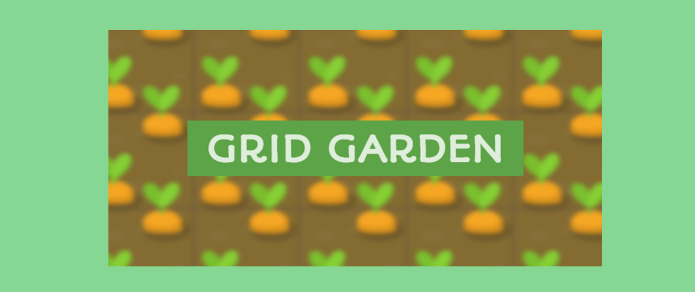
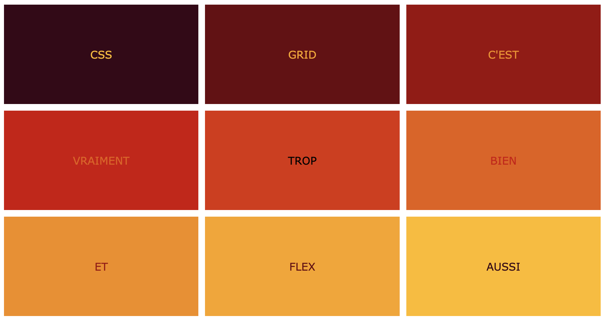

<!-- omit in toc -->
# Exercices CSS Grid

Voici quelques exercices pour un peu manipuler les animations.

<!-- omit in toc -->
## :memo: Objectifs

- Apprendre à manipuler CSS Grid
- Suivre des consignes précises.
- Apprendre à se débrouiller en allant lire la théorie vue ou la documentation.

<!-- omit in toc -->
## :white_check_mark: Evaluations

- Respect des consignes.
- La syntaxe est correcte.
- L'indentation est correcte.

<!-- omit in toc -->
## Légende des difficultés

Facile: 😄
Modéré: 😊
Exigeant: 😅
Épineux: 😰
Impossible?: 😡

<!-- omit in toc -->
## Table des matières

- [😄 \> 😰 CSS Grid Garden](#---css-grid-garden)
- [😄 Créer une grille basique](#-créer-une-grille-basique)

## 😄 > 😰 CSS Grid Garden

Tout comme pour Flexbox, voici un jeu pour vous apprendre à utiliser grid. Essaye d'aller le plus loin possible.

[CSSGridGarden](https://cssgridgarden.com/#fr)

## 😄 Créer une grille basique

**Objectif :** Créer une grille de 3x3 (trois colonnes et trois rangées) où chaque cellule a une taille égale.

**Instructions :**

- Utilise display: grid pour définir un conteneur grid.
- Définis trois colonnes et trois rangées de taille égale.
- Place un élément avec du texte dans chaque cellule de la grille.
- Utilise la propriété `grid-gap` pour ajouter un espace entre chaque cellule.
- Utilise la propriété `background-color` pour ajouter une couleur de fond différent à chaque cellule.
- Utilise **flexbox** pour centrer le texte dans chaque cellule.

> :bulb: Aide toi de la fonction `repeat()` pour définir les colonnes et les rangées.
