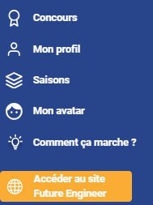

# Logique de programmation

## Introduction

Dans cet exercice vous allez apprendre grâce à [Amazon Future Engineer](https://app.futureengineer.fr/login), la logique de programmation, la façon de "parler" à une machine et la gestion d'un ordinateur.
- Créez votre compte et retenez votre mot de passe.
- Rendez-vous dans l'onglet "Saisons" sur la gauche. 

- Sélectionnez la saison 1 et l'épisode 1.
- Faites bien attention de sélectionner l'onglet "Blockly". 

- Vous devez choisir "l'épisode 1 : la cascade" et simplement démarrez l'exercice. 

