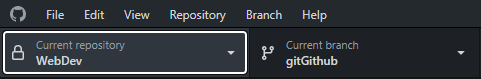
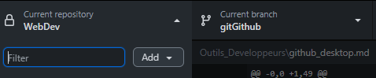
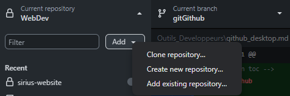
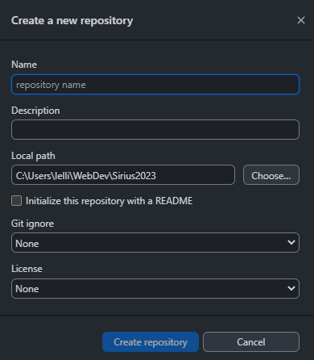
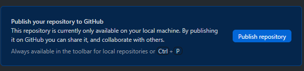
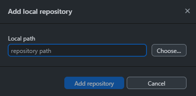
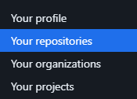
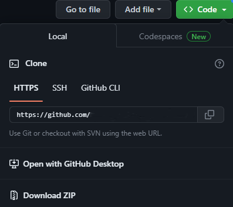
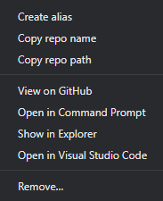
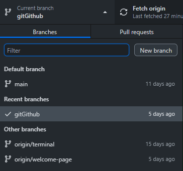

<!-- omit in toc -->
# Git & Github

<!-- omit in toc -->
## Table des matières
- [Rappel : introduction](#rappel--introduction)
- [Installation](#installation)
- [Rappel : repositery](#rappel--repositery)
- [Rappel : .gitignore](#rappel--gitignore)
- [Ajouter un projet, cloner un projet](#ajouter-un-projet-cloner-un-projet)
- [Naviguer avec Github Desktop](#naviguer-avec-github-desktop)
- [Les branches](#les-branches)
- [Conclusion](#conclusion)

## Rappel : introduction

Github Desktop ne vient pas de nulle part, il répond à un besoin des développeurs. Il a été créer dans le but d'archiver en ligne tous les changements que le développeur et ses collaborateurs feront dans le code source du site ou du logiciel. Durant notre formation nous avons utilisés assez régulièrement **Git** et voici le temps pour l'utilisation de l'interface *Github Dekstop*. Le programme Github Desktop est beaucoup plus simple à utiliser que le programme de base, **Git** qui lui comme vous l'avez vu est dépourvu d'une interface visuelle.

## Installation

1. Logiquement en début de formation vous avez créer votre compte [Github](https://github.com/) ou lier votre adresse mail.
2. Télécharger et installer la version Windows de Github Desktop via ce [lien](https://desktop.github.com/). Pour les utilisateurs de Mac ou de Linux, le site devrait vous proposer la bonne version.
3. Une fois le programme installé, ouvrez-le et connectez-vous avec votre compte précédemment créer.

## Rappel : repositery

Qu'est qu'un repositery (dépôt) ? 
Prenons comme exemple un fichier local sur votre machine, c'est pareil ! A part que le repositery lui est **en ligne**, contient tout l'**historique** des changements que vous avez effectués et permet à vos collègues de **contribuer** eux aussi au projet, pas mal non ⁉ 
Un exemple concret, votre site web fonctionne bien et vous décider de faire une mise à jour. A cause des modifications que vous venez de faire votre site est inutilisable, quoi que vous fassiez impossible de trouver la source du problème. Vous avez grâce à Git la possibilité de revenir en arrière en parcourant votre historique sur Github !

## Rappel : .gitignore

Il y a certains fichiers qu'il ne faut jamais publier sur Github, pour des raisons de sécurité et/ou de confidentialité. Le fichier ``.gitignore`` existe pour exclure de l'envoi les fichiers que vous ne devez pas publier. Je vous recommande fortement de prendre l'habitude de toujours créer ce fichier à **chaque nouveau projet**.

## Ajouter un projet, cloner un projet

Si tu as bien lié ton compte github.com à Github Desktop, lorsque tu cliques sur le menu déroulant en haut à gauche du programme : 
 
Tu auras la possibilité d'ajouter un repositery au programme Github Desktop : 
 
En cliquant sur le bouton *Add* ou *Ajouter* tu auras 3 possibilités : 

1. Clone repositery
   - Cette option te permet de cloner un projet déjà tracké sur ta machine donc en locale. C'est un projet existant sur Github.com.

2. Create new repositery
   - Cette option te permet de créer un repositery totalement vierge. Ce modal apparaitra :  
 
   - Si tu souhaites le publier directement sur Github.com et commencé le tracking, il faut cliquer sur **Publish repositery** : 
 

3. Add existing repositery
    - Cette option permet d'ajouter un dossier qui n'est pas encore tracké et donc pas disponible sur Github.com. Vous devez choisir le dossier de votre projet dans le modal suivant : 

4. Une autre façon d'ajouter un repositery : 
   - Un projet qui est déjà sur Github.com mais pas sur Github Desktop ni sur ta machine. Sur le site [https://github.com/](Github.com), clique sur ta photo de profil et accède à tes repositories : 

   - Lorsque tu es sur le repositery que tu souhaites cloner sur ta machine clique sur le bouton vert **code** :

   - Il ne reste plus qu'à cliquer sur ***"Open with Github Desktop"***

## Naviguer avec Github Desktop

Grâce à cette interface tu peux aussi :
- Cliquer pour accèder au menu déroulant : 
 
Cela affichera une liste de tes projets.
- Dans la liste si tu cliques droit sur l'un de tes projets plusieurs options s'offrent à toi : 

- Voici celles qui nous intéresse : 
  - **View on GitHub** : permet de voir le projet sur github.com.
  - **Show in Explorer** : permet d'ouvrir le dossier à l'emplacement du fichier de votre machine.
  - **Open in Visual Studio Code** : permet d'ouvrir le dossier du projet directement dans VSCode.

## Les branches

Rien de plus simple lorsque tu souhaites créer une branche :
- Il faut sélectionner le repository dans lequel tu veux créer une nouvelle branche, clique ensuite sur cet autre menu déroulant : 

- De nouveau quelques options :

<!-- This is where i stopped the 20/06/23 -->

## Conclusion

Git et Github sont des outils indispensables pour un développeur et pour travailler en équipe. Il y a beaucoup d'avantage quand on l'utilise bien et nous aurons tout le reste de la formation pour se familiariser avec ce formidable outil. 
**Fini les clés USB, Github est là !**

[:arrow_up: Revenir au top](#table-des-matières)

[:rewind: Retour au sommaire du cours](../../WebDev/)

> Cours original : Lucas Ielli