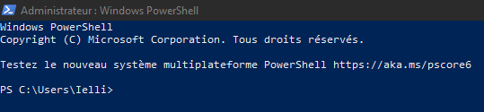

<!-- omit in toc -->
# Le Terminal

# A quoi cela sert ?

Aujourd'hui Windows est pourvu d'une interface graphique qui est facile et intuitive mais ça n'a pas toujours été le cas. Pour les moins jeunes, vous vous souviendrez peut-être de l'image ci-dessous. Oui, au début les ordinateurs avait une interface qui n'était composé que de lignes de texte parfois incompréhensible. C'était la seule manière d'afficher ce qui était contenu dans un ordinateur, évidemment le contenu n'était autre que des données, des fichiers et des dossiers. Aujourd'hui le terminal est indispensable pour les utilisateurs de Linux mais Windows aurait pu s'en passer **cependant** les informaticiens et nous les développeurs avons toujours besoin de certaines fonctionnalités que nous aurons l'occasion d'aborder dans peu de temps. Fun fact : parmi les développeurs aguéris (surtout sur Linux) l'utilisation de la souris est quasiment proscrite et donc le terminal devient la seule manière de naviguer et de manipuler les données.

# Installation

Dans un premier temps nous allons vérifier que vos ordinateurs possèdent bien la bonne version du terminal Windows PowerShell, en effet si votre ordinateur est sur Windows 10 vous risquez d'avoir les yeux qui piquent un peu.

Pour ouvrir votre terminal vous avez deux options :
- Via votre barre de recherche en tapant ``Windows Powershell`` 
 
- Via le menu démarrer en cliquant droit ou en utilisant le raccourci ``Win+X`` (en admin = moins de problèmes) 

Si vous êtes sur Windows 10 il y a de grandes chances que vous tombiez sur ceci : 

> Je vous avais dit que ça piquerait 😂

En réalité c'est simplement que Windows 10 n'embarque pas la nouvelle version du PowerShell. Nous allons donc remedier à cela :

1. https://learn.microsoft.com/fr-fr/powershell/scripting/whats-new/migrating-from-windows-powershell-51-to-powershell-7?view=powershell-7.3
2. https://learn.microsoft.com/fr-fr/powershell/scripting/install/installing-powershell-on-windows?view=powershell-7.3#winget
3. https://lecrabeinfo.net/ouvrir-et-utiliser-le-terminal-windows-sur-windows-11-10.html

